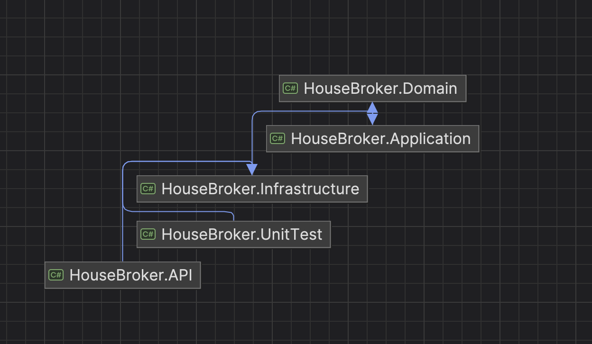
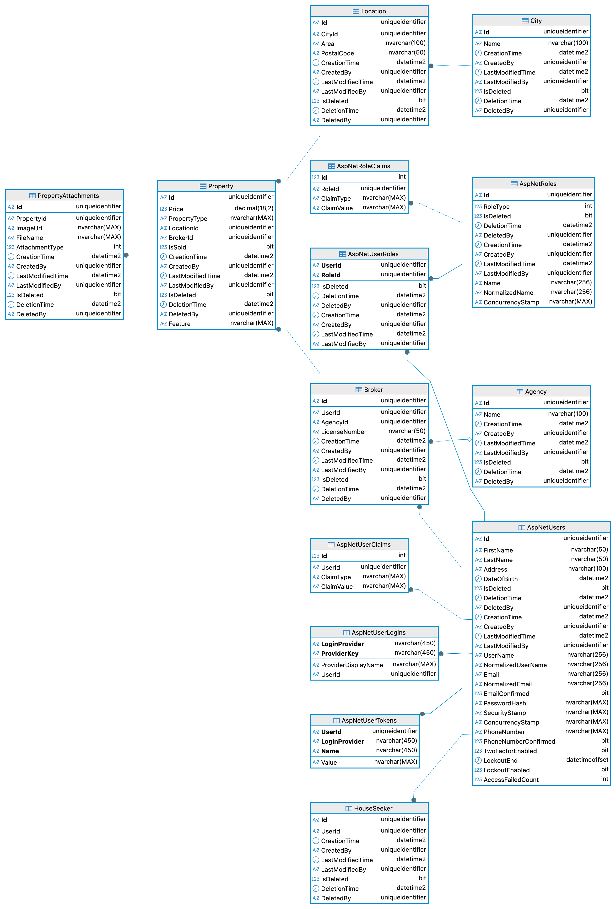

# 🏠 HouseBroker

**HouseBroker** is a modular, maintainable, and scalable real estate application built with **.NET 8**, using **Clean Architecture**, **CQRS**, and **MediatR**.

---

## 🚧 Technologies Used

- ✅ ASP.NET Core 8 Web API
- ✅ Entity Framework Core
- ✅ SQL Server (via Docker)
- ✅ CQRS with MediatR
- ✅ ASP.NET Core Identity (JWT)
- ✅ xUnit for Unit Testing
- ✅ Soft Delete & Auditing
- ✅ Clean Architecture (Domain → Application → Infrastructure → API)
- ✅ Docker (for SQL setup and containerized infrastructure)

---

## 📦 Project Structure

```
HouseBroker/
│
├── HouseBroker.API             # API Layer - Controllers, Middlewares, Dependency Injection
├── HouseBroker.Application     # Application Layer - CQRS, DTOs, Interfaces, Behaviors
├── HouseBroker.Domain          # Domain Layer - Entities, Enums
├── HouseBroker.Infrastructure  # Infrastructure Layer - EF Core, Auth, Image Storage, Service
├── HouseBroker.UnitTest        # Unit Tests - xUnit + Moq
```

---

## 🧱 Architectural Overview

- **CQRS** (Command Query Responsibility Segregation):
  - `Commands` mutate state.
  - `Queries` return data only.
- **MediatR** decouples requests from handlers.
- **Behaviors** (like validation and unit of work) are used as pipeline middleware.

Example:

```csharp
public class RegisterUserCommand : ICommand<AuthResponseDto> { ... }

public class RegisterUserCommandHandler : ICommandHandler<RegisterUserCommand, AuthResponseDto> { ... }
```

---

## 🐳 Running Locally with Docker

### 1. Clone Repository
```bash
git clone https://github.com/your-username/housebroker.git
cd housebroker
```

### 2. Start SQL Server with Docker
Make sure Docker is installed and running.

```bash
docker-compose up -d
```
This will start a SQL Server container on port `1433` with default credentials:
- User: `sa`
- Password: `Your_password123`
- DB: `HouseBrokerDb`

> If you're using a local SQL Server instance instead, update your connection string accordingly.

### 3. Copy and Update App Settings

```bash
cp appsettings.example.json HouseBroker.API/appsettings.json
```
Update DB connection strings, JWT settings, and image base URL as needed.

### 4. Apply EF Migrations

```bash
cd HouseBroker.API
 dotnet ef database update
```

### 5. Run the API
```bash
dotnet run --project HouseBroker.API
```
Visit: `http://localhost:5053/swagger`

---

## 🧪 Running Tests
Run unit tests with:
```bash
dotnet test
```

---

## 🔐 Authentication

- ASP.NET Core Identity with `UserManager`, `RoleManager`, and `SignInManager`
- JWT Bearer Tokens
- Role-based authorization (`[RoleAuthorization(RoleEnum.Admin)]`)

---

## 📤 Image Upload

- Upload images using `IImageStorageService`
- Stored in `wwwroot/images`
- Accessed via public URL configured in `ImageBaseUrl`

---

## 🚀 Features

- User Registration & Login
- Role Management (Admin, Broker, HouseSeeker)
- Property CRUD
- Attachment upload/delete
- Clean, testable codebase
- Full MediatR CQRS structure
- Soft delete with filtering

---

## 📜 User Name & Password

Included in Seeder.cs
- admin@housebroker.com - admin@1234
- broker@housebroker.com - broker@1234
- seeker@housebroker.com - seeker@1234
---

## Architecture



## Database Schema



--

## 🙋 Maintainer

Made by **Rozeen Nakarmi**
